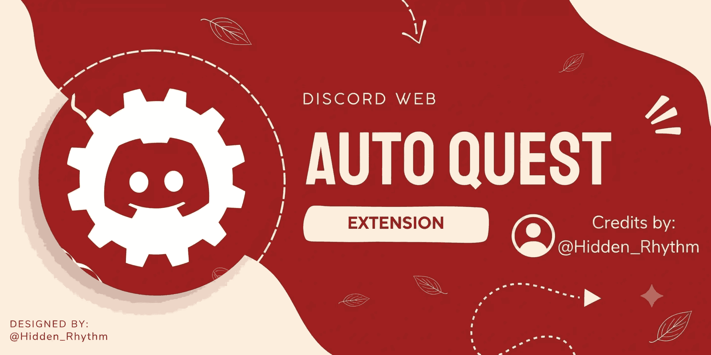

<div align="center">

# ⚡ Discord Auto Quest Extension

**Automatically complete supported Discord Quests directly from Discord Web.**

<br>

<a href="https://github.com/Hidden-Rhythm/Discord-Auto-Quest-Extension">
  
</a>
<a href="https://discord.com/">
  
</a>

<br><br>



</div>

---

## ✦ What is this?

**Discord Auto Quest Extension** is a Chrome/Chromium browser extension that automates supported Discord Quest progress while using **Discord Web**.

Instead of manually completing supported quest activities, the extension injects its quest handler into Discord's web client and communicates with Discord's internal quest APIs to update progress.

It currently supports quest types including:

* 🎥 Watch Video
* 🖥️ Play on Desktop
* 📡 Stream on Desktop
* 🎮 Play Activity
* 📱 Watch Video on Mobile

The extension also provides a small in-page interface showing active quest progress and completion status.

---

## ✨ Features

| Feature                        | Description                                                       |
| ------------------------------ | ----------------------------------------------------------------- |
| ⚡ **Automatic Quest Progress** | Processes supported active Discord Quests automatically           |
| 🎥 **Video Quest Support**     | Sends incremental video progress updates                          |
| 🖥️ **Desktop Quest Support**  | Handles heartbeat-based desktop quest progress                    |
| 🎮 **Activity Support**        | Supports Discord activity-based quest tasks                       |
| 📊 **Live Progress UI**        | Displays current progress directly inside Discord                 |
| ✅ **Completion Detection**     | Detects when a quest reaches its required target                  |
| 🔄 **Automatic Updates**       | Keeps quest progress synchronized while running                   |
| 🌐 **Discord Web Integration** | Designed specifically for Discord's web client                    |
| 🧩 **Manifest V3**             | Uses the modern Chrome extension architecture                     |
| 🕵️ **User-Agent Handling**    | Provides Discord desktop-style User-Agent handling where required |

---

## 🧠 How It Works

The extension operates through several components:

```text
┌──────────────────────┐
│     Discord Web      │
└──────────┬───────────┘
           │
           ▼
┌──────────────────────┐
│   Quest Home UI      │
│  Progress / Controls │
└──────────┬───────────┘
           │
           ▼
┌──────────────────────┐
│  Background Worker   │
│  Script Injection    │
└──────────┬───────────┘
           │
           ▼
┌──────────────────────┐
│   Quest Code         │
│ Webpack / Quest API  │
└──────────┬───────────┘
           │
           ▼
┌──────────────────────┐
│ Discord Quest APIs   │
│ Progress / Heartbeat │
└──────────────────────┘
```

The extension waits for Discord's Webpack runtime, locates the required internal stores/API modules, identifies active quests, and processes supported quest tasks.

---

## 🎯 Supported Quest Types

The current implementation recognizes:

```text
WATCH_VIDEO
PLAY_ON_DESKTOP
STREAM_ON_DESKTOP
PLAY_ACTIVITY
WATCH_VIDEO_ON_MOBILE
```

### Video quests

For video-based quests, the extension sends incremental progress through Discord's quest video-progress endpoint.

```text
Quest
  ↓
Read current progress
  ↓
Increment timestamp
  ↓
Send progress update
  ↓
Check completion
  ↓
Repeat
```

### Heartbeat quests

For desktop/activity-style quests, the extension uses Discord's heartbeat mechanism with an appropriate stream key.

```text
Quest
  ↓
Find available channel
  ↓
Create stream key
  ↓
Send heartbeat
  ↓
Read server progress
  ↓
Repeat until complete
```

---

## 🖥️ In-Discord Interface

When you're on the Discord Quest page, the extension adds a small **Running Quests** control.

It can display:

```text
┌─────────────────────────────────┐
│ Running Quests              ▼   │
└─────────────────────────────────┘

┌─────────────────────────────────┐
│ Quest Name              120/300 │
│ Another Quest           300/300 │
│                                 │
│ Discord ID | Auto Quest         │
│ Made by Hidden_Rhythm           │
└─────────────────────────────────┘
```

Completed quests are marked as:

```text
DONE
```

while active quests display their current progress.

---

## 📁 Project Structure

```text
Discord-Auto-Quest-Extension/
│
├── assets/
│   ├── banner.png
│   └── icon.png
│
├── background.js
├── manifest.json
├── quest-code.js
├── quest-home.js
├── rules.json
├── user-agent-check.js
└── user-agent-override.js
```

### `manifest.json`

Chrome Manifest V3 configuration, permissions, host permissions, content scripts, background service worker, and declarative network rules.

### `background.js`

Handles extension messages and injects the quest execution script into the active Discord tab.

### `quest-code.js`

Core quest automation logic.

Responsible for:

* Detecting Discord's Webpack runtime
* Locating Discord internal modules
* Finding active quests
* Reading quest progress
* Processing video progress
* Processing heartbeat progress
* Detecting completion
* Sending progress updates to the UI

### `quest-home.js`

Creates the visible Discord Web interface:

* Running Quests button
* Expandable progress panel
* Quest progress display
* Completion states
* Extension status feedback

### `rules.json`

Contains the declarative network rule used to modify the Discord request `User-Agent`.

### `user-agent-override.js`

Overrides browser-reported User-Agent/platform values for Discord Web.

---

## 🚀 Installation

This extension is currently provided as an unpacked Chrome/Chromium extension.

### 1. Download the repository

Clone the repository:

```bash
git clone https://github.com/Hidden-Rhythm/Discord-Auto-Quest-Extension.git
```

Or download the repository as a ZIP and extract it.

### 2. Open Chrome Extensions

Navigate to:

```text
chrome://extensions/
```

### 3. Enable Developer Mode

Enable **Developer mode** in the top-right corner.

### 4. Load the extension

Click:

```text
Load unpacked
```

Select the extracted:

```text
Discord-Auto-Quest-Extension
```

folder.

### 5. Open Discord Web

Open:

```text
https://discord.com/
```

Then navigate to the Discord Quest page.

The extension will add its quest control to the page.

---

## ⚙️ Permissions

The extension requests the following Chrome permissions:

```text
declarativeNetRequestWithHostAccess
scripting
activeTab
```

It also requests Discord host access for:

```text
https://*.discord.com/*
```

These permissions are required for the extension to interact with Discord Web, inject its quest handler, and apply its network rules.

---

## ⚠️ Important Notes

This project relies on **Discord's current web-client internals and quest API behavior**.

Because Discord can change its client implementation at any time:

* Internal Webpack modules may change.
* Quest endpoints may change.
* Quest task formats may change.
* The extension may stop working after Discord updates.
* Some quests may not be supported.

The extension is therefore best treated as a **client-side automation experiment**, not a guaranteed permanent solution.

> Use responsibly and understand that automating Discord activities may not be consistent with Discord's current Terms or individual quest requirements.

---

## 🔐 Privacy

The extension does not contain a traditional backend server or external database.

Its functionality is implemented through browser-side JavaScript running against Discord Web.

The extension does, however, interact with Discord's own web application and APIs while you are logged into Discord.

Review the source code before installing any browser extension, especially extensions that request access to a website where you are authenticated.

---

## 🛠️ Technology

| Technology              | Usage                            |
| ----------------------- | -------------------------------- |
| JavaScript              | Extension logic                  |
| Chrome Extensions API   | Browser integration              |
| Manifest V3             | Extension architecture           |
| Discord Webpack Runtime | Internal module discovery        |
| Discord Quest API       | Quest progress                   |
| Declarative Net Request | Request header modification      |
| MutationObserver        | Discord SPA navigation detection |

---

## 🔄 Execution Flow

```text
Extension Loaded
       │
       ▼
Discord Web Opened
       │
       ▼
Quest Home Detected
       │
       ▼
User Starts Quest Runner
       │
       ▼
Background Worker
       │
       ▼
Inject quest-code.js
       │
       ▼
Wait for Discord Webpack
       │
       ▼
Locate Discord Stores + API
       │
       ▼
Find Active Supported Quests
       │
       ▼
Process Quest
       │
       ├── Video Progress
       │
       └── Heartbeat Progress
       │
       ▼
Update Progress UI
       │
       ▼
Quest Completed
```

---

## 📌 Version

Current extension version:

```text
1.2.6
```

defined in `manifest.json`.

---

## 👤 Author

**Hidden_Rhythm**

Built as a browser-side Discord automation project.

<div align="center">

### ⚡ automate less. build more.

</div>
